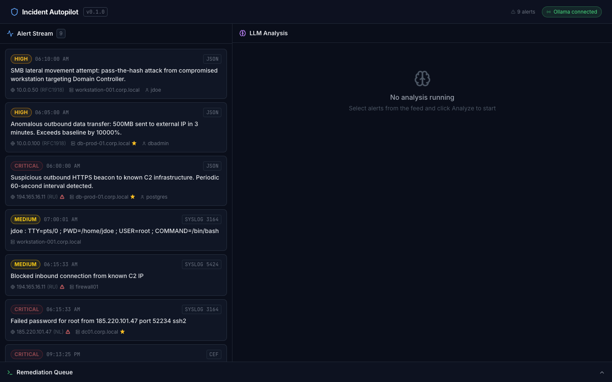
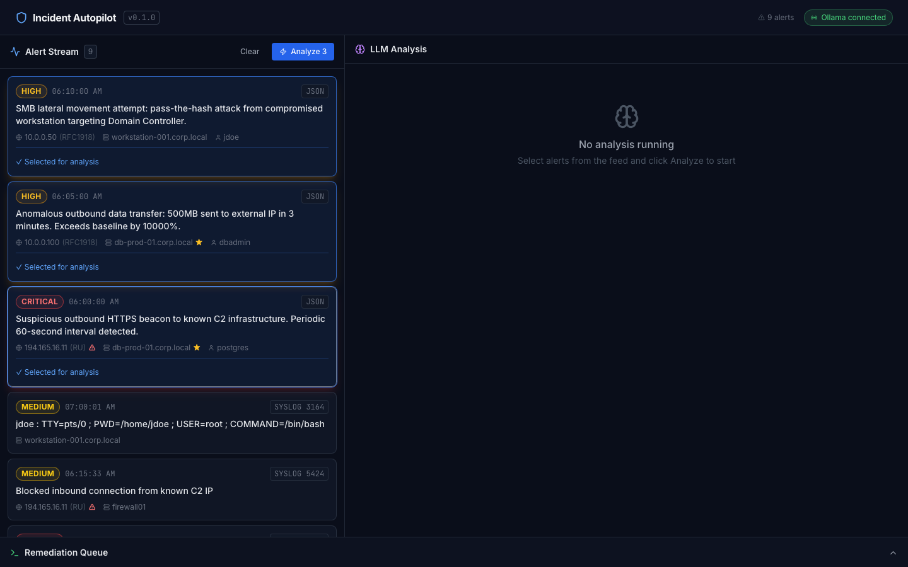
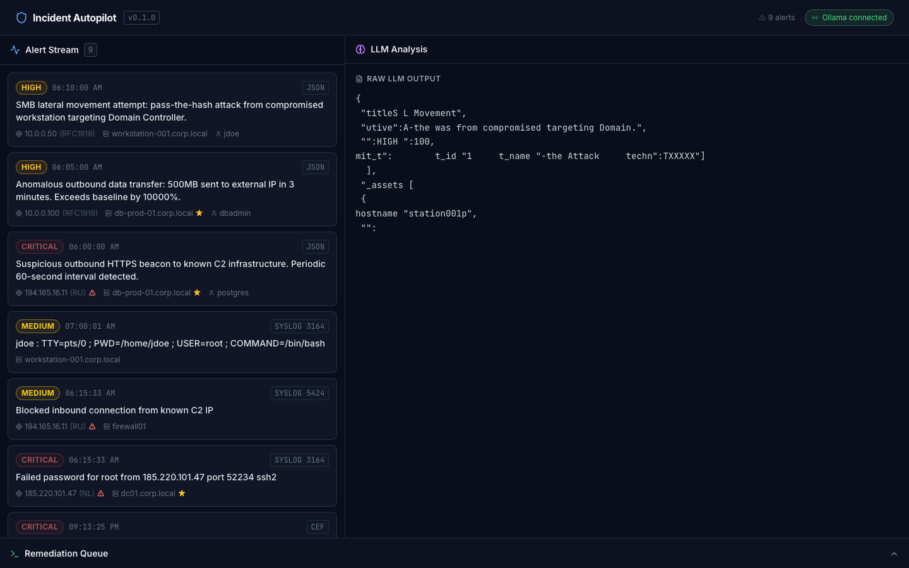
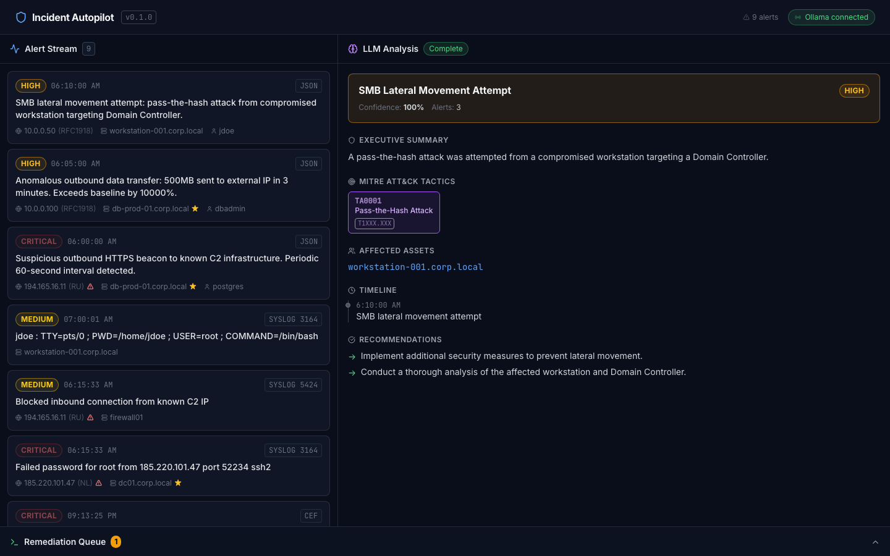
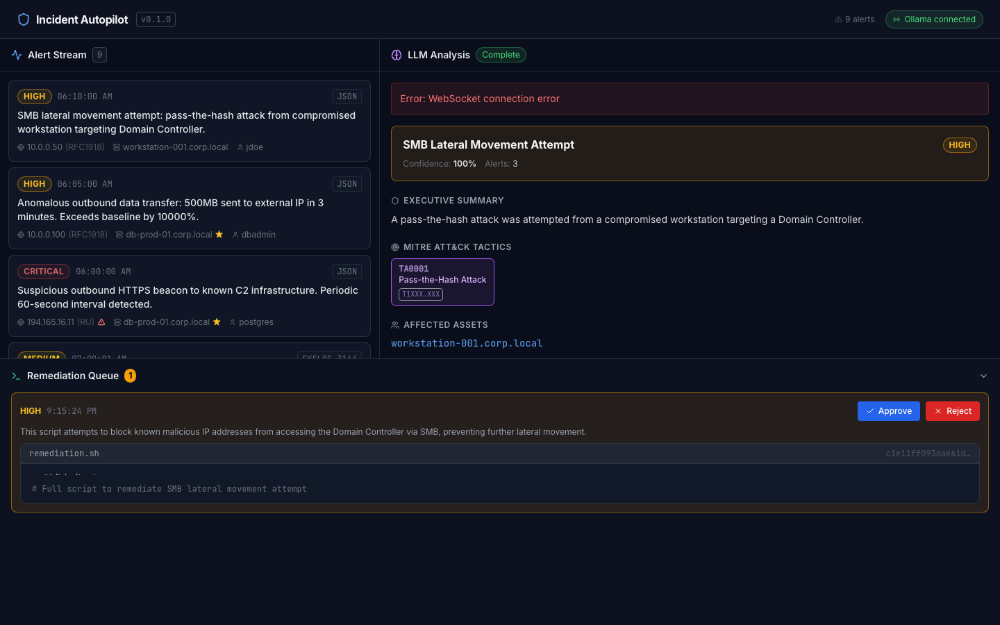

# Incident Autopilot

**Feed raw SIEM alerts into a local LLM. Get a structured IR report and Bash remediation script streamed back in one shot.**

[](https://github.com/rayankarimcheca/incident-autopilot/actions/workflows/backend-ci.yml)
[](https://github.com/rayankarimcheca/incident-autopilot/actions/workflows/frontend-ci.yml)
[](https://www.python.org/)
[](https://www.typescriptlang.org/)
[](LICENSE)

---

## What It Does

SOC analysts spend 30–90 minutes per alert chain translating cryptic, multi-format log output (CEF, Syslog, JSON) into incident response narratives — then another 20–40 minutes hand-authoring iptables block rules and remediation scripts under pressure.

Incident Autopilot is a self-contained SOC IR sandbox that:

1. **Ingests** raw alerts in any format (CEF, RFC 3164/5424 Syslog, JSON) via REST API
2. **Normalizes and enriches** each event — GeoIP, threat-intel reputation, asset criticality tier
3. **Streams** a structured IR report token-by-token from a local Ollama model — MITRE ATT&CK tactic tagging, affected asset enumeration, confidence score, severity classification
4. **Auto-generates** a context-aware Bash remediation script in the same pipeline
5. **Gates** HIGH/CRITICAL scripts behind a manual approval queue before simulated execution

Zero cloud dependency. Zero per-token cost. Runs entirely on local hardware.

---

## Demo Walkthrough

### 1 — Dashboard with 9 alerts loaded



The left panel shows the live alert feed populated from 9 sample alerts spanning CEF (brute force, port scan, malware), Syslog (auth failure, firewall block, sudo escalation), and JSON (C2 beacon, data exfiltration, lateral movement). Severity badges — CRITICAL (red), HIGH (amber), MEDIUM (yellow) — are color-coded throughout. The status bar confirms Ollama is reachable and shows the current alert count.

---

### 2 — Select alerts for analysis



Click any combination of alert cards to stage them for analysis. Selected cards highlight in blue. The "Analyze N" button appears in the header once at least one alert is selected.

---

### 3 — Report generation triggered



Clicking **Analyze** fires `POST /api/reports/generate` to the backend. The WebSocket connection opens immediately. The right panel transitions from empty state to streaming mode.

---

### 4 — LLM streaming live


Tokens arrive from Ollama via the WebSocket and are rendered with a blinking cursor. The raw JSON stream is visible as it builds — title, severity, MITRE tactics, affected assets, timeline, recommendations. The model generates the entire structured report in one shot.

---

### 5 — IR Report complete



Once the stream ends the raw JSON is parsed and rendered as a structured report: MITRE ATT&CK tactic pills, asset enumeration with criticality tiers, confidence percentage, and an executive summary written for a non-technical audience. A remediation script is auto-queued in the background.

---

### 6 — Report recommendations


Scrolling down reveals the full recommendation set and attack timeline extracted by the model. Recommendations are ordered by priority.

---

### 7 — Remediation queue


The bottom drawer slides up to show the remediation queue. LOW and MEDIUM severity scripts are auto-approved and flagged `auto-approved`. HIGH and CRITICAL scripts wait for operator action.

---

### 8 — Script review and approval



Each queue item shows the severity, the LLM-generated rationale, the SHA-256 hash of the script body, and a syntax-highlighted Bash preview (Prism.js). Clicking **Approve** calls `POST /api/remediation/{id}/approve`, logs a `SimulatedExecutor` record, and marks the item EXECUTED. No real shell commands run — this is a sandbox.

---

## Architecture

```
Raw alert (CEF | Syslog RFC 3164/5424 | JSON)
        │
        ▼
POST /api/alerts/ingest
        │
Format detector → parser → NormalizedEvent (Pydantic)
        │
Enrichment: GeoIP mock + threat-intel mock + asset criticality
        │
In-memory ring-buffer store (cap: 10,000 events)
        │
GET /api/alerts  ──────────────────────→  Frontend alert feed (2s poll)
        │
POST /api/reports/generate { alert_ids }
        │
Build IR_REPORT_PROMPT with enriched context
        │
Ollama streaming call (temp=0.2)
        │
Tokens fanned out → WebSocket /ws/reports/{id}  →  Frontend typewriter
        │
Final JSON parsed (with retry-repair on malformed output)
        │
IRReport persisted  →  Auto-trigger remediation
        │
Build REMEDIATION_PROMPT with IR report as context
        │
Ollama completion → BashScript (sha256 hashed + danger-pattern validated)
        │
Severity gate:
  LOW/MEDIUM   → auto-approve → SimulatedExecutor (no real shell)
  HIGH/CRITICAL → ApprovalQueue → operator action required
        │
GET /api/remediation/queue  →  Frontend drawer (3s poll)
POST /api/remediation/{id}/approve | /reject
```

### Key Design Decisions

| Decision | Rationale |
|---|---|
| **Local Ollama** | Zero data leaves the network — required for classified/regulated environments. Works with any model: `llama3.2:1b` for speed, `llama3:8b` or larger for quality |
| **In-memory store** | Removes Elasticsearch infra dependency for the sandbox. Trade-off: no persistence across restarts |
| **WebSocket over SSE** | Allows future bidirectional control (cancel in-flight, regenerate). Trade-off: slightly more client complexity |
| **Single-prompt structured JSON** | One LLM round-trip for the full report. Retry-with-repair handles occasional malformed output |
| **Severity gate hardcoded** | Keeps demo legible; HIGH/CRITICAL always require human approval |
| **Pydantic v2 at every boundary** | Runtime validation on HTTP, WebSocket, and LLM output |
| **Bash script validation** | LLM-generated scripts are checked for dangerous patterns (eval, curl\|sh, wget\|sh) before storage |

---

## Tech Stack

### Backend
- **Python 3.11** + **FastAPI 0.115** — async ASGI, OpenAPI, native WebSocket
- **Pydantic v2** — strict type validation at every system boundary
- **httpx** — async streaming client to Ollama daemon
- **Ollama** — local LLM inference, any model works
- **structlog** — JSON-structured logging
- **python-dateutil** — robust multi-format timestamp parsing for Syslog
- **pytest + pytest-asyncio** — full async test suite (49 tests)

### Frontend
- **React 18** + **TypeScript 5.4 strict** + **Vite 5**
- **Tailwind CSS 3.4** — dark-theme-first utility CSS
- **Zustand 4** — lightweight client state
- **TanStack Query 5** — stale-while-revalidate polling
- **Prism.js** — Bash syntax highlighting in the remediation viewer
- **Vitest** — unit tests for API client, store, constants

---

## Requirements

- **Python 3.11+**
- **Node.js 20+**
- **[Ollama](https://ollama.com)** — any model

### Install Ollama

```bash
# macOS
brew install ollama

# Linux
curl -fsSL https://ollama.com/install.sh | sh
```

### Pull a model

```bash
# Fast and lightweight (good for demos)
ollama pull llama3.2:1b

# Better quality (recommended for real use)
ollama pull llama3:8b

# Any other Ollama model works too
ollama pull phi3:mini
ollama pull mistral:7b
```

Set the model in `.env`:
```bash
OLLAMA_MODEL=llama3.2:1b   # or any model you pulled
```

---

## Quick Start (local dev)

```bash
git clone https://github.com/rayankarimcheca/incident-autopilot
cd incident-autopilot

# 1. Start Ollama
ollama serve &

# 2. Backend
cd backend
python3.11 -m venv .venv
source .venv/bin/activate
pip install -r requirements.txt
uvicorn app.main:app --reload --port 8000

# 3. Frontend (new terminal)
cd ../frontend
npm install --legacy-peer-deps
npm run dev

# 4. Ingest sample alerts (new terminal)
bash scripts/ingest_samples.sh

# 5. Open http://localhost:5173
```

---

## Docker Compose

```bash
cp .env.example .env
docker compose up --build

# Pull a model inside the Ollama container (first run only)
docker exec incident-autopilot-ollama ollama pull llama3.2:1b

# Open http://localhost:5173
```

---

## API Reference

### Ingest an alert
```bash
# CEF format
curl -X POST http://localhost:8000/api/alerts/ingest \
  -H "Content-Type: application/json" \
  -d '{"raw": "CEF:0|Vendor|IDS|1.0|100|SSH Brute Force|8|src=185.220.101.47 dst=10.0.0.5 dpt=22"}'

# JSON format
curl -X POST http://localhost:8000/api/alerts/ingest \
  -H "Content-Type: application/json" \
  -d '{"raw": "{\"event_type\": \"c2_beacon\", \"severity\": \"critical\", \"src_ip\": \"194.165.16.11\", \"message\": \"C2 beacon detected\"}"}'

# Syslog RFC 3164
curl -X POST http://localhost:8000/api/alerts/ingest \
  -H "Content-Type: application/json" \
  -d '{"raw": "<34>Oct 11 22:14:15 mymachine sshd[1234]: Failed password for root from 185.220.101.47 port 52234 ssh2"}'
```

### List alerts
```bash
curl http://localhost:8000/api/alerts
```

### Generate an IR report
```bash
# Get alert IDs first, then:
curl -X POST http://localhost:8000/api/reports/generate \
  -H "Content-Type: application/json" \
  -d '{"alert_ids": ["<id1>", "<id2>"]}'
# Returns: {"id": "<report_id>", "status": "STREAMING", ...}
```

### Connect to the live token stream
```bash
wscat -c ws://localhost:8000/ws/reports/<report_id>
# Receives: {"type":"token","token":"{"} ... {"type":"final","report":{...}}
```

### Approve or reject a remediation script
```bash
curl -X POST http://localhost:8000/api/remediation/<id>/approve \
  -H "Content-Type: application/json" \
  -d '{"approver": "analyst@corp.local"}'

curl -X POST http://localhost:8000/api/remediation/<id>/reject \
  -H "Content-Type: application/json" \
  -d '{"approver": "analyst@corp.local", "reason": "False positive — blocked IP is a CDN node"}'
```

### Health check
```bash
curl http://localhost:8000/api/health
# {"status":"ok","ollama_reachable":true,"alert_count":9,"report_count":1,"queue_count":2}
```

---

## Ingest All Sample Alerts

```bash
bash scripts/ingest_samples.sh

# → CEF alerts
#   ✓ [HIGH]     SSH Brute Force Attack
#   ✓ [HIGH]     Nmap Port Scan Detected
#   ✓ [CRITICAL] Trojan.GenericKD Detected
#
# → Syslog alerts
#   ✓ [CRITICAL] Failed password for root from 185.220.101.47
#   ✓ [MEDIUM]   Blocked inbound connection from known C2 IP
#   ✓ [MEDIUM]   sudo escalation: jdoe → root
#
# → JSON alerts
#   ✓ [CRITICAL] Suspicious outbound HTTPS beacon to known C2
#   ✓ [HIGH]     Anomalous outbound data transfer: 500MB sent
#   ✓ [HIGH]     SMB lateral movement attempt: pass-the-hash
```

---

## Supported Alert Formats

### CEF (ArcSight Common Event Format)
```
CEF:0|Vendor|Product|Version|SignatureID|Name|Severity|Extensions
```
Parsed fields: `src`, `dst`, `spt`, `dpt`, `shost`, `dhost`, `suser`, `sproc`, `rt`

### Syslog RFC 3164 (BSD)
```
<PRI>Mmm DD HH:MM:SS hostname process[pid]: message
```

### Syslog RFC 5424
```
<PRI>VERSION TIMESTAMP HOSTNAME APP-NAME PROCID MSGID [SD-DATA] MSG
```
Structured data key-value pairs are extracted from `[SD-DATA]`.

### JSON
Any JSON object with recognizable fields. Supports multiple naming conventions:
- Severity: `severity`, `level`, `priority`, `sev`
- Timestamp: `timestamp`, `time`, `ts`, `@timestamp`, `event_time`
- Source IP: `src_ip`, `source_ip`, `src`
- Message: `message`, `msg`, `description`, `alert_name`

---

## Running Tests

### Backend
```bash
cd backend
source .venv/bin/activate
pytest tests/ -v
# 49 tests in ~0.06s

pytest tests/ --cov=app --cov-report=term-missing
```

### Frontend
```bash
cd frontend
npm install --legacy-peer-deps
npm test          # run once
npm run test:coverage  # with coverage report
# 65 tests — lib/api, lib/constants, store/appStore
```

---

## Technical Deep-Dive

### Alert Parser Pipeline

The CEF parser uses a state-machine approach: split on the first 7 pipes to extract header fields, then apply a greedy regex over the extension string that handles unescaped spaces within values correctly. RFC 3164 and 5424 Syslog parsers are implemented as separate regexes — the formats differ enough in their timestamp and structured-data sections that a unified regex would be fragile.

### LLM Output Integrity

Ollama at temperature 0.2 reliably produces valid JSON ~85% of the time when given a tight schema instruction in the system prompt. The remaining ~15% produce valid JSON buried in prose ("Here is the report:"). The repair pipeline:
1. Try `json.loads()` on the full response
2. Scan for `{...}` blocks with a greedy regex, try each
3. Retry the full LLM call with an explicit "your response was not valid JSON" prefix

### Severity Gate and Script Validation

The approval gate is a pure function: `LOW`/`MEDIUM` auto-approve and flow through `SimulatedExecutor.run()` which records what *would* have executed without invoking any real shell. `HIGH`/`CRITICAL` sit in the queue until an operator approves. Critically, before any LLM-generated script is stored, it is checked for dangerous patterns — `eval`, `curl|sh`, `wget|sh`, `base64 -d|sh` — and rejected if found. The approve/reject API uses an atomic `transition_remediation()` call (lock-protected read-check-update) to eliminate the TOCTOU race condition in concurrent approvals.

### WebSocket Fan-Out

`WSBroker` maintains a `dict[report_id, list[WebSocket]]` with a 20-subscriber cap per report. When the Ollama stream yields a token, `broker.publish()` iterates subscribers, catches dead connections, and removes them. The WebSocket endpoint verifies the report exists before accepting the connection and rejects connections when the subscriber cap is reached.

### In-Memory Store

`InMemoryStore` wraps a `collections.deque(maxlen=cap)` for O(1) append and automatic eviction of the oldest alert. A separate `dict[id → event]` provides O(1) lookup by ID. All methods acquire a `threading.Lock` because FastAPI background tasks and WebSocket handlers run in different threads.

---

## Project Structure

```
incident-autopilot/
├── backend/
│   ├── app/
│   │   ├── api/          # FastAPI routers: health, alerts, reports, remediation, ws
│   │   ├── core/         # Settings, logging, constants
│   │   ├── models/       # Pydantic models: alerts, reports, remediation, ws messages
│   │   ├── services/     # Parsers, enrichment, store, Ollama client, prompt templates
│   │   └── utils/        # Hashing, ID generation, JSON repair
│   └── tests/            # 49 unit + integration tests
├── frontend/
│   └── src/
│       ├── components/   # Alert feed, analysis panel, remediation drawer, UI primitives
│       ├── hooks/        # useAlerts, useReportStream, useRemediationQueue, useOllamaHealth
│       ├── lib/          # API client, WebSocket manager, constants
│       ├── store/        # Zustand state (selected alerts, streaming text, drawer)
│       ├── test/         # Vitest unit tests (65 tests)
│       └── types/        # TypeScript mirrors of all Pydantic models
├── docs/screenshots/     # Live demo screenshots
├── sample-alerts/        # 9 sample alerts (3 CEF, 3 Syslog, 3 JSON)
├── scripts/              # ingest_samples.sh, check_ollama.sh
└── docker-compose.yml
```

---

## License

MIT — see [LICENSE](LICENSE).

---

Built with [Ollama](https://ollama.com) · [FastAPI](https://fastapi.tiangolo.com) · [React](https://react.dev) · local Llama 3
